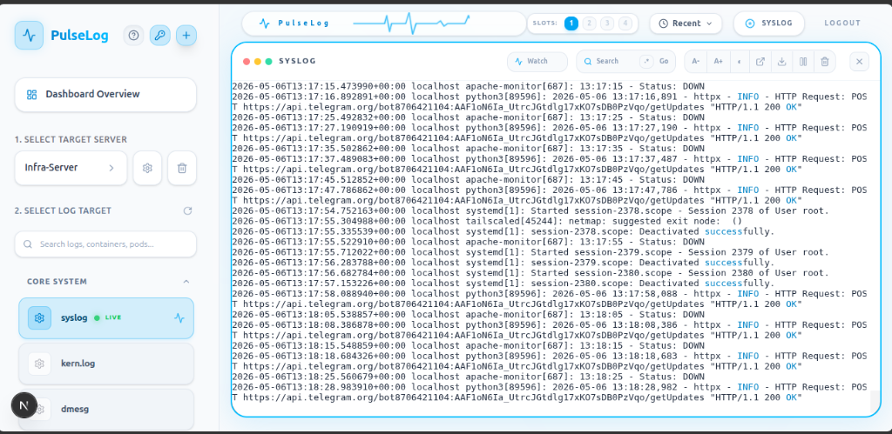

# 🫀 PulseLog — Cinematic Infrastructure Log Monitoring



**PulseLog** is a high-performance, centralized log monitoring system designed for modern infrastructure. Built with a cinematic, high-tech aesthetic, it provides real-time streaming of system, container, and application logs via secure SSH tunnels.

Unlike traditional logging stacks that require complex agents and storage, PulseLog is **transient and agent-light**. It discovers and streams logs directly from your target servers on-demand, leaving zero footprint.

---

## ✨ Key Features

- **🌐 Universal Discovery**: Automatically detects Docker containers, Kubernetes pods, Nginx, Apache, System logs, Security/Auth logs, and various Databases (MySQL, Postgres, Redis, MongoDB).
- **💓 Pulse Telemetry**: Real-time "Heartbeat" (EKG) waveform indicating the live status and health of the log stream.
- **🖥️ Multi-Log Matrix (Split View)**: Monitor up to 4 independent log streams simultaneously in a dynamic grid (1, 2, or 4 slots) that auto-adjusts its layout.
- **🚀 Monitor Expansion (Pop-out)**: Move any terminal slot to a dedicated browser window for multi-monitor setups or vertical screen viewing.
- **📋 Security Audit Trail**: 
  - Comprehensive logging of user access and log viewing activity.
  - Advanced search with natural language time parsing (e.g., "yesterday at 5pm").
  - CSV export functionality for compliance and security reviews.
- **🛠️ Multi-Cloud & Hybrid**: Manage multiple servers (Production, Staging, Edge) from a single unified interface.
- **🔍 Advanced Search & Watch**: 
  - Live server-side filtering with Regex support.
  - **Auto-Trigger Search**: Debounced input (400ms delay) automatically filters logs as you type, eliminating manual triggers.
  - **Instant Clear & Resume**: Embeds a clear button inside the search field to reset filters and immediately resume the live unfiltered log stream.
  - "Watch" keywords to highlight critical events in real-time.
- **🧠 AI Anomaly Diagnostics (Groq Llama-3.3)**: 
  - Real-time error spike monitoring that alerts operators if more than 3 errors (e.g., `ERROR`, `CRITICAL`, `FATAL`) occur in a sliding 10-second window.
  - **One-Click AI Diagnosis**: Powered by Groq and the `llama-3.3-70b-versatile` model, generating detailed incident briefs structured into *Observed Symptoms*, *Immediate Failure Mechanism*, *Probable Root Causes* (with Confidence Classifications), and *Evidence*.
  - **LRU Diagnostic Cache (API Cost & Speed Optimization)**: Memory-safe server-side LRU Cache with a 5-minute TTL. Generates a SHA-256 hash of log text; identical diagnostics resolve instantly (~10ms) without making expensive network calls to Groq.
  - **Semantic Log Pruning**: Maximizes LLM token density and lowers API costs by dynamically stripping high-frequency static asset traffic (CSS, JS, images) and standard health-check noise before LLM analysis.
  - **Diagnostic Report Export**: One-click download options to save the diagnostic report as a clean Markdown (`.md`) document or export it as a styled PDF with browser URL print headers and page footers automatically stripped.
- **🛡️ Hardened Security**:
  - **AES-256-GCM** encryption for SSH private keys at rest.
  - **Restricted Execution**: Uses a security wrapper (`log-wrapper.sh`) on target servers to limit SSH access to log viewing only.
  - **Ephemeral Credential Decryption (In-Memory Zero-Persistence)**: Private keys remain encrypted during transit through all backend endpoints and are decrypted *only* within the localized scope of the SSH connection handshakes. Immediately after connection initialization, the decrypted key variable is set to `null` to wipe references from Node's memory heap, mitigating risk against heap-dump exploits.
  - **Detached Process Group Cleanup**: Launches SSH streams in detached process groups and sends a `SIGKILL` to the negative PID on stream disconnect, preventing zombie/orphaned processes and preserving server resources.
  - **Three-Tier SOC Security State Machine (The Sentinel)**: Dynamically classifies security logs into three enterprise SOC tiers to eliminate false alarms while catching real breaches:
    - *Protected* (Sensitive path &rarr; 401/403/404): `LOW` severity, `Protected` status, `Active Incidents: No`. Suppresses alert noise.
    - *Suspicious* (Sensitive path &rarr; 3xx redirect): `MEDIUM` severity, `Suspicious` status, `Active Incidents: Yes`. Alerts the operator to audit redirect configurations.
    - *Compromised* (Sensitive path &rarr; 200/201, or active RCE/privilege escalation indicators): `CRITICAL` severity, `Compromised` status, `Active Incidents: Yes`. Immediately alerts the team to active exploit attempts.
  - **RCE Hard Stop Override**: Instantly triggers critical severity if active Remote Code Execution (RCE), shell spawning, or privilege escalation signatures are detected (e.g. `/bin/sh`, `bash -c`, `curl | sh`, `sudo`, `chmod`, `nc -e`, `eval(`, `exec(`).
  - **Role & Group-Based Permissions**: Restrict Viewer operators to specific server groups.
  - **JWT Authentication** with session blacklisting.
- **⚡ Pro UI/UX**:
  - Cinematic dark mode, glassmorphic elements, and Xterm-powered terminal rendering.
  - **Micro-Animations**: Live connection ping halos and pulse animations for real-time status.
  - **Interactive Hover Scales**: Lift-on-hover actions on the connected servers grid.
  - **Aesthetic Elements**: Soft emerald badge live states, ambient blue focus halos on forms, and sky-gradient primary buttons.

---

## 🚀 Tech Stack

- **Frontend**: [Next.js](https://nextjs.org/) (App Router), [Tailwind CSS](https://tailwindcss.com/), [Lucide Icons](https://lucide.dev/).
- **Terminal Engine**: [Xterm.js](https://xtermjs.org/) with Fit Addon.
- **Backend**: Node.js, [Socket.io](https://socket.io/) for real-time streaming.
- **Connectivity**: [ssh2](https://github.com/mscdex/ssh2) for secure remote command execution.
- **Database**: [SQLite3](https://www.sqlite.org/) for local server and user management.
- **Process Management**: [PM2](https://pm2.io/).

---

## 🛠️ Installation & Setup

### 1. Prerequisites
- **Node.js**: v20 or later.
- **PM2**: Global installation (`npm install -g pm2`).

### 2. Clone and Install
```bash
git clone https://github.com/your-repo/central-log-viewer.git
cd central-log-viewer
npm install
```

### 3. Environment Configuration
Create a `.env` file in the root directory:
```env
PORT=3000
JWT_SECRET=your_ultra_secure_jwt_secret
# ENCRYPTION_KEY can be here, but for better security, PulseLog looks for ~/.pulselog_key
GROQ_API_KEY=your_groq_api_key_here
```

### 4. Security Hardening (Recommended)
To fully secure your instance:
1. **Restrict Permissions**: Run `chmod 600 .env data/database.sqlite` and `chmod 700 data`.
2. **External Encryption Key**: Move your `ENCRYPTION_KEY` from `.env` to a file outside the project root:
   ```bash
   # Extract key from .env and save to secure location
   grep ENCRYPTION_KEY .env | cut -d'=' -f2 > ~/.pulselog_key
   chmod 600 ~/.pulselog_key
   # Now remove ENCRYPTION_KEY from .env
   ```
   PulseLog will automatically detect this file.

### 4. Linux Target Server Preparation

You can register a remote Linux server either by using the automated one-line installer (recommended) or performing a manual setup.

#### Option A: One-Line Automation Setup (Recommended)
This uses a secure, single-use, time-restricted registration token generated from the admin dashboard to configure the node automatically:
1. In the sidebar, click the **`+` (Add Server)** button.
2. Copy the generated one-line command displayed under **One-Line Automation Setup**:
   ```bash
   curl -fsSL -k "https://<pulselog-server>/api/setup-node?token=<token>" | bash
   ```
3. Run this command on the target server. It will automatically:
   - Create directories and deploy the secure `log-wrapper.sh` wrapper script.
   - Configure key-based SSH authorization with secure execution restrictions.
   - Detect the node's hostname/IP and automatically register it back to the PulseLog dashboard database.

#### Option B: Manual Configuration Setup
If you prefer to configure nodes manually or are restricted from running installation scripts:
1. Copy the `log-wrapper.sh` script from the PulseLog root directory to the home directory of the SSH user on the target server.
2. Make it executable: `chmod +x ~/log-wrapper.sh`.
3. Locate the Master SSH Public Key from the admin settings and restrict it in the target node's `~/.ssh/authorized_keys` file by prepending the command filter:
   ```ssh
   command="/path/to/log-wrapper.sh",no-port-forwarding,no-X11-forwarding,no-agent-forwarding,no-pty ssh-ed25519 AAA...
   ```
4. Fill in the server credentials (Host IP, SSH Port, User, and SSH Key) manually in the **Add Server** panel inside the PulseLog dashboard, and click **Save**.

### 5. Windows Target Server Preparation
To monitor a Windows machine, you must enable OpenSSH and (optionally) install the security wrapper:

1.  **Open PowerShell as Administrator**.
2.  **Install & Start SSH**:
    ```powershell
    Add-WindowsCapability -Online -Name OpenSSH.Server~~~~0.0.1.0
    New-NetFirewallRule -Name sshd -DisplayName 'OpenSSH Server (sshd)' -Enabled True -Direction Inbound -Protocol TCP -Action Allow -LocalPort 22
    Start-Service sshd
    Set-Service -Name sshd -StartupType 'Automatic'
    ```
3.  **Security Wrapper & Permissions**:
    - **Enable Scripts**: Run `Set-ExecutionPolicy RemoteSigned -Force`.
    - **Install Wrapper**: Copy `log-wrapper.ps1` from this repository to `C:\ProgramData\PulseLog\log-wrapper.ps1`.
    - **Setup Key**: Paste your public key into `C:\Users\<username>\.ssh\authorized_keys`.
    - **Fix Permissions**: Windows requires strict permissions. Run these in Admin PowerShell:
      ```powershell
      $user = "YOUR_WINDOWS_USERNAME"
      icacls "C:\Users\$user\.ssh\authorized_keys" /inheritance:r
      icacls "C:\Users\$user\.ssh\authorized_keys" /grant:r "${user}:F"
      icacls "C:\Users\$user\.ssh\authorized_keys" /grant:r "SYSTEM:F"
      ```
    - **Restrict Key (Optional)**: Edit `authorized_keys` to force the wrapper:
      ```ssh
      command="powershell.exe -ExecutionPolicy Bypass -File C:\ProgramData\PulseLog\log-wrapper.ps1",no-port-forwarding ssh-rsa AAA...
      ```

### 6. Start PulseLog
```bash
npm run dev
```
The application will be available at `http://localhost:3000`.

---

## 📖 Usage Guide

### Admin Control Panel
Administrators can configure system settings via the **Admin Settings (gear icon)** next to the User Guide button in the sidebar:
1. **User Permissions (KeyRound)**:
   - Create and manage operator accounts.
   - Assign security access roles: **Admins** (full system access) and **Viewers** (restricted log stream access).
   - Restrict Viewer visibility to specific Server Groups.
2. **Server Groups (Folder)**:
   - Create, edit, and categorize groups of servers (e.g., "Production", "Staging", "API Nodes").
   - Helps partition server lists and manage client/viewer visibility permissions dynamically.
3. **Add Server (Plus)**:
   - Onboard new Linux or Windows target nodes using one of two methods:
     - **Automated Setup:** Copy the generated one-line command and execute it directly on the remote Linux node to auto-enroll the server.
     - **Manual Setup:** Enter target credentials (host IP, port, username) and paste the private key. PulseLog automatically encrypts all private keys at rest (AES-256-GCM).
   - Test connectivity immediately using the built-in **Test Connection** utility.

### Monitoring Logs
1. Select a server from the sidebar.
2. PulseLog will automatically scan the server and categorize available logs.
3. Click a **Slot (1-4)** in the header to select where you want the log to appear.
4. Click a log source in the sidebar to start the stream in that slot.
5. Use the **Pop-out** icon (↗️) to move a terminal to another monitor.
6. Use the **Watch** input to highlight specific words (e.g., "ERROR" or "500").
7. Toggle **Dim Mode** (◐) or adjust **Font Size** (A+/A-) for optimal viewing.

### 🧠 AI Diagnostics & Error Spike Analysis
1. When an error spike is detected (3+ errors in a 10-second window), a flashing red alert button **"Analyze Spike with AI"** will appear on the active terminal slot.
2. Click this button to open the full-screen AI Diagnostic overlay.
3. The system securely sends the log snippet surrounding the spike to the AI diagnostic proxy (using your configured `GROQ_API_KEY`).
4. The generated report outlines the Root Cause, What Happened, and Recommended Actions (such as NGINX configuration adjustments or dependency installs).

### Security Auditing
1. Go to the **Dashboard Overview**.
2. Scroll to the **Security Audit Trail** section.
3. Use the search bar with natural language dates (e.g., "apr 20-22") to find specific access logs.
4. Click **Export CSV** to download logs for compliance reporting.

---

## 🔒 Security Model

PulseLog is designed with a "Zero-Trust" mindset for log viewing:
- **No Log Storage**: Logs are streamed via memory buffers and never written to the PulseLog server's disk.
- **Forced Commands**: By using the `log-wrapper.sh`, you ensure that even if the SSH key is compromised, it can ONLY be used to discover and read logs, not to gain shell access.
- **Encryption**: Sensitive credentials (private keys) are encrypted using authenticated encryption (AES-256-GCM), preventing tampering or unauthorized reading even if the database file is accessed.

---

## 🔮 Future Roadmap (v1.1+)

Following the successful **v1.0 Production Release**, the following architectural enhancements have been approved for the next development cycle to further refine context-awareness and metrics isolation:

1. **Dimensional Metric Separation (Security vs. Operations)**:
   - Decouple security event analysis from operational server diagnostics by tracking `securityScore` and `operationalScore` as independent vectors.
   - Prevent blended scores so that a high volume of internet scanner activity does not inflate operational application severity metrics (e.g., keeping a high-volume scan categorized as `SECURITY: LOW` while a single critical database timeout is correctly escalated as `APPLICATION: HIGH`).
2. **Context-Aware IP Classification (Internal vs. External)**:
   - Introduce network boundary awareness. 
   - Parse client IP addresses to treat whitelisted parser warnings (e.g., `Invalid HTTP Version`) as harmless scanner noise ONLY when originating from external IPs, while immediately escalating them to `HIGH` severity if they originate from internal proxies (e.g., `10.x.x.x` or loopback addresses), signaling an active infrastructure misconfiguration.
3. **Config-Driven Security Heuristics**:
   - Move hardcoded harmless patterns and protocol abuse signatures into a structured configuration file (YAML/JSON).
   - Allow operators to customize rules, suppress specific local scanner noise, or escalate proprietary protocol anomalies without modifying the core codebase.
4. **AI Confidence Ceilings**:
   - Enforce realistic confidence ceilings in the AI system prompts (e.g., capping `CRITICAL` confidence at `95%` and `HIGH` at `90%`) to align diagnostic outputs with standard SRE humility and prevent speculative overconfidence.

---

## 📄 License
MIT License. See [LICENSE](LICENSE) for details.
